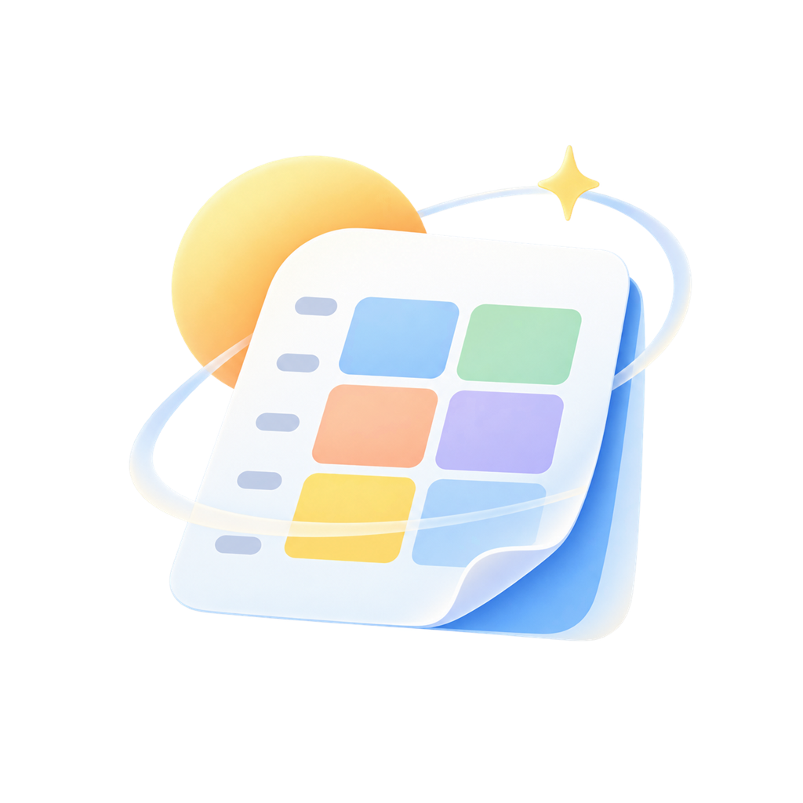

<p align="center">
  
</p>

# 几点上课 · 原生安卓版

面向同学的非官方共享课表**原生 Android App**（目前只适配了韩师）。克制、清晰的校园工具风，支持「应用内打开教务系统网页、登录后脚本直接导入课表」。

后端是 `backend/` 下的 Fastify + SQLite 实现，提供匿名设备身份、课表分享与同步、单周调课、情侣绑定、应用更新分发、并发版本保护与发布安全基线。

## 为什么是原生安卓

- 包体小：release 经 R8 + 资源压缩后约 **1.5 MB**；
- 无跨端框架运行时开销，启动快、内存低；
- 可直接内嵌 WebView 打开教务系统，登录后注入脚本本地解析课表，省去「浏览器导出 → 文件传输 → 选择文件」的绕行。

## 功能

- 周课表：整周一屏、左侧节次与上下课时间、今天高亮、单双周角标；同一时段撞在一起的课（如重修课与原班课）在同一格里左右并排，每门都看得见、点得开；
- 周次切换：两侧箭头、点击「第 N 周」选择（每格标出该周起始日期）、左右滑动翻周（带方向一致的滑入滑出与首末周回弹）；
- 课程详情：底部抽屉展示周次、节次、时间、教室、教师；
- 课程配色：20 个明暗分层预设色，自动配色避开同课表里的近似色，一门课的颜色在翻周、增删课程、跨设备后都不变；长按课程可手动选色或用自定义调色板，手动颜色随课表同步给加入的同学；
- 课表外观：格子高度、格子留白、文字大小可调，可「自动铺满一屏」；可选「显示已上状态」，已经下课的课变灰并标「已上」（精确到分钟）；外观只存本机；
- 自定义日程：点课表空格子即可添加社团、兼职等自己的安排，可按节次或按钟点填写，支持仅这一周 / 每周 / 单周 / 双周；与课撞了会提示并给出一键避让；日程只存在本机，不会分享给同学，也不受重新导入影响；
- 单次调课：在整学期日历上直接点目标日期，节次用胶囊行点选，可选新教室，冲突确认、修改与撤销；
- 停课与补课（假期调休）：在整学期日历上点日期设置，可连停多天，补课两步点选来源日和目标日；停课日课程半透明并标「停课」，补课日显示来源日全天课表并标「补课」，表头带「休/补」角标；设置随课表同步；
- 周六日显示：默认只在正在查看的周有周末课程、调课、停课或补课时展开 7 列；也可改为始终显示；
- 课表库：多课表管理、当前课表切换、同步状态、更新/分享/删除（退出）；同步失败的课表标红点并说明原因，发布者删除课表后提示是否移除；
- 导入：教务系统 WebView、本地文件、剪贴板、粘贴源码/JSON；解析后可选择新建或覆盖当前课表，覆盖以最新导入为准并清空旧手动调课；
- 分享与加入：8 位分享码、加入前摘要、订阅后自动同步、复制/更换分享码、系统分享；
- 情侣课表：一方生成邀请码、另一方输入即可绑定，双方的当前课表只对彼此可见；「我们」页的日视图把两人一天的安排按真实时间左右排开，并显示对方上课中还是空闲；周视图把两人的课叠在一张课表上、按人上色，可「只看 TA」、高亮两人都有空的时段；名字和颜色双方都能改，对方改了会提示一次；任意一方解绑双方立刻解除；
- 上课提醒：在当前课表每节课开始前 5/10/15/20/30 分钟发通知（普通通知，不是响铃闹钟），调课、停课、补课都按实际安排提醒；同一门课同一教室连着上只提醒第一段；可选同时提醒自己的日程；设置页检测「通知」「闹钟和提醒」「后台运行」三项系统授权并引导开启，可发测试通知；
- 应用内更新：启动与设置页检查新版本，从自己的服务器下载安装包；内置「正式版 / 测试版」更新通道，可添加自定义通道；
- 设置：服务状态、服务器地址（可换成自建服务器、一键恢复默认）、复制同步日志、隐私与关于说明、删除本人全部数据；
- 空白本机模式：后端域名为空时课表仅保存在本机，首次启动为 0 份课表，不注入任何预置课程；
- 离线优先：无论是否配置数据服务，查看、导入、调课、日程、切换和删除都直接使用本机课表；联网只用于分享码、情侣课表与跨设备同步。

## 快速开始

1. 构建 App（需要 Android SDK 与 JDK 21）：
   ```powershell
   .\gradlew.bat :app:assembleDebug
   ```
   产物：`app\build\outputs\apk\debug\app-debug.apk`。
2. 本机模式：不传 `-PapiBaseUrl` 即可；导入的课表保存在本机，分享/加入需配置后端。
3. 接自有后端：构建时传 `-PapiBaseUrl=https://api.example.com`。

## 改后端域名（全局唯一变量）

```powershell
.\gradlew.bat :app:assembleDebug -PapiBaseUrl=https://api.example.com
```

正式构建强制要求 HTTPS API、发布签名且禁止开发身份；ApiClient、设置页和导出助手地址都读取同一 BuildConfig 值。

> 发布签名密钥（`keystore/` 与根目录 `keystore.properties`）不进 Git，务必另行备份到安全位置：密钥一旦丢失，已安装用户将无法覆盖升级，只能卸载重装。

## 项目结构

```text
app/                 原生 Android 应用（Kotlin + XML Views，AppCompat-only）
  src/main/java/com/zhusijiao/app/
    AppConfig.kt       全局配置：后端域名（唯一变量）、教务入口
    domain/            模型、日期、配色/周次、EAMS 解析器、日程、情侣课表（按人分栏、当天安排、都有空）
    data/              ApiClient（OkHttp）、原子本机存储、离线缓存、情侣状态、Prefs
    ui/common/         AppHeader、BottomNavView、TimetableView、情侣日视图、各类底部面板、BaseActivity
    reminder/          上课提醒：排下一次定时、发通知、开机/改时间后重排、系统授权检测
    ui/schedule|library|settings|importer|join|share|eams|event|couple|reminder/   各页面
  src/main/assets/eams-export.js   WebView 注入的教务课表导出脚本
backend/             Fastify + SQLite 后端（匿名设备登录、课表与调课服务、情侣绑定）
backend/public/app/  应用更新分发目录（release.json + APK）
```

## 开源协议与致谢

本项目以 **Apache License 2.0** 开源（见 [`LICENSE`](LICENSE)）。

- **[拾光课程表](https://github.com/XingHeYuZhuan/shiguangschedule)**（Apache-2.0，Copyright (C) 2025 XingHeYuZhuan）：教务（EAMS）课表解析的实现思路参考自该项目，本项目按同一算法思路重新实现（`domain/EamsParser.kt`、`assets/eams-export.js`、`backend/src/eams-parser.js` 三处同步维护），未复制图片或品牌素材。感谢原作者。

本项目文案一律称「学校」「教务系统」，并明确声明本项目为非官方工具。

当前代码是可构建、可联调的完整实现；教务解析基于 EAMS 响应结构，正式上线前仍需用真实脱敏课表回归验证。
